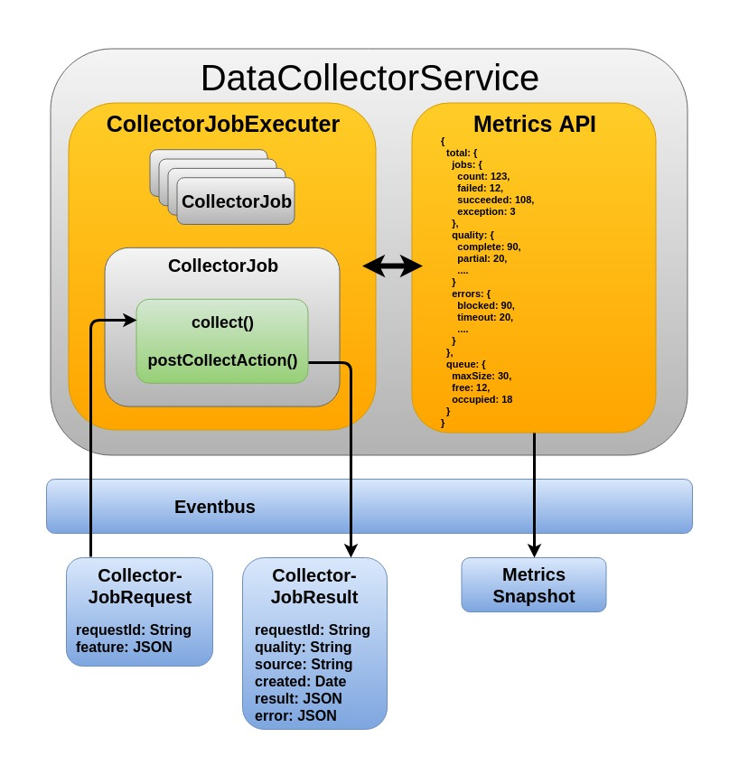

# vertx-datacollector

A framework to collect and post-process data from any source.

* [Import](#import)
* [Get Started](#get-started)
  * [CollectorJob](#collectorjob)
  * [DataCollectorServiceVerticle](#datacollectorserviceverticle)
  * [DataCollectorService](#datacollectorservice)
  * [DataCollectorServiceClient](#datacollectorserviceclient)
* [Architecture](#architecture)
* [JavaDoc](#javadoc)
* [Run tests](#run-tests)
* [Contribute](#contribute)
  * [Code Style](#code-style)

## Import

Maven

```
<dependency>
  <groupId>info.pascalkrause</groupId>
  <artifactId>vertx-datacollector</artifactId>
  <version>0.0.1</version>
  <scope>compile</scope>
</dependency>
```

Gradle

```Gradle
compile 'info.pascalkrause:vertx-datacollector:0.0.1'
```

## Get Started

### CollectorJob

The first step is to implement the actual collector job (e.g. crawl a dataset from a website). The collector job should
be implemented in the Future which is returned by the _collect()_ method. The Future will be executed in a seperate
worker thread, which allows to have blocking operations here.

```Java
public Handler<Future<CollectorJobResult>> collect(String requestId, JsonObject feature);
```

After the collection step is done, it is possible to do some post-processing stuff (e.g. write result into database)
in the Future which is returned by the _postCollectAction_ method, which also can handle blocking operations.

```Java
public Handler<Future<CollectorJobResult>> postCollectAction(AsyncResult<CollectorJobResult> result);
```

### DataCollectorServiceVerticle

After implementing the CollectorJob, the verticle can be deployed.

* **ebAddress**: The eventbus address
* **job**: The job which will be processed in the CollectorJobExecutor
* **workerPoolSize**: The pool size of the CollectorJobExecutor
* **queueSize**: The queue size of CollectorJob requests
* **enableMetrics**: Enables metrics for the DataCollectorService

```Java
DataCollectorServiceVerticle verticle = new DataCollectorServiceVerticle(
  ebAddress, job, workerPoolSize, queueSize, enableMetrics);

vertx.deployVerticle(verticle);
```

### DataCollectorService

When the verticle was successfully deployed, the DataCollectorService can connect to the verticle. A list of
methods which are offered by the DataCollectorService can be found
[here](https://caspal.github.io/vertx-datacollector/info/pascalkrause/vertx/datacollector/service/DataCollectorService.html).

```Java
String ebAddress = "addressOfCollectorVerticle";
DataCollectorServiceFactory factory = new DataCollectorServiceFactory(vertx, ebAddress);

DataCollectorService dcs = factory.create();
// or with DeliveryOptions
DeliveryOptions delOpts = new DeliveryOptions .....
DataCollectorService dcs = factory.create(delOpts);
```

### DataCollectorServiceClient

The DataCollectorService is a Vert.x proxy which must stick to some restrictions to be able to translate this service
also into other languages. The idea of the DataCollectorServiceClient is, having a Java client that can be used as a
facade for the DataCollectorService to offer higher-value functions and do some Java specific converting e.g.
error trasnformation. A list of methods which are offered by the DataCollectorServiceClient can be found
[here](https://caspal.github.io/vertx-datacollector/info/pascalkrause/vertx/datacollector/client/DataCollectorServiceClient.html).

```Java
DataCollectorService dcs = .....
DataCollectorServiceClient dcsc = new DataCollectorServiceClient(dcs);
```

## Architecture



## JavaDoc

The latest JavaDoc can be found [here](https://caspal.github.io/vertx-datacollector/index.html).

## Run tests

```Bash
./gradlew test
```

## Contribute

We are using Gerrit, so PRs in Github will probably overlooked. Please use [GerritHub.io](https://review.gerrithub.io)
to contribute changes. The project name is _caspal/vertx-datacollector_

### Code Style

1. Encoding must be in UTF-8.
2. Change must have a commit message.
3. The line endings must be LF (linux).
4. The maximum length of a line should be between 80 and 120 characters.
5. Use spaces instead of tabs.
6. Use 4 spaces for indentation
7. No trailing whitespaces.
8. Avoid unnecessary empty lines.
9. Adapt your code to the surroundings.
10. Follow the default language style guide.
    * [Java](http://www.oracle.com/technetwork/java/codeconventions-150003.pdf)

An Eclipse formatter can be found in the _resources_ folder.
